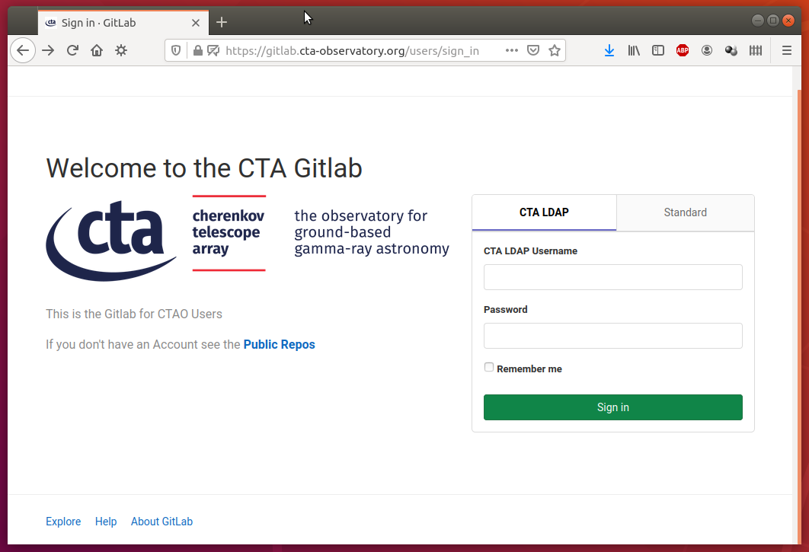
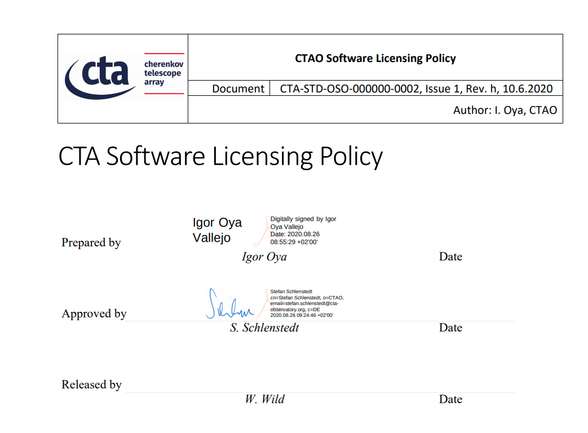

% CTA developers seminar - gitlab & gitlabCI
% Dominik Neise
% 24.02.2021

---

# Before we begin - Flipped classroom

 - people watch videos in their own good time
 - people meet for (rather short?) online meetings to discuss questions


[](https://www.youtube.com/watch?v=MJUJ4wbFm_A)

# What do I get from this?

 - How to create a gitlab repo & set it up
 - How to setup a CI runner
 - A "simple" gitlab-ci file

# Introduction to GitLab



# How to get an account?

 - getting an account should be **super easy**

 - <https://cta.cta-observatory.org/web-registry>
 - ... ask your boss for help
 - use your LDAP account.

# How to create a repository

 - set the visibility to universal.
 - add a `README.md`
 - protect your `main` branch (Yes, even when you work alone.)

    Settings -> Repository -> Protected Branches

 - add a `LICENSE` (BSD-3, see next slide)


# CTA Licensing Policy

<https://forge.in2p3.fr/dmsf/files/8629/view>



For IKC:
```
Copyright [year] <contributor entity>
This software was provided as IKC to the Cherenkov Telescope Array Observatory
This software is distributed under the terms of the BSD-3-Clause license
```

# Interesting places to see:

 - Issues
 - Analytics -> CI/CD
 - Analytics -> Repo
 - Settings -> Repo -> Protected Branches (we saw already)
 - Settings -> CI/CD
 - Download as compressed files
 - Packages & registries
 - Wiki
    - personal opinion: Use it carefully, it is easy to miss
    - Language is markdown. \\o/

 - Snippets
    - maybe a nice place for examples
    - not subject to CI tests, so an be full of bugs.


# MR demo

We're doing it live!
[](https://www.youtube.com/watch?v=vu2NK5REvWM)

 - Draft / WIP
 - Describe  (unless already done in an issue)
 - Delete source branch when merge request is accepted.
 - Be nice in a review
     - Maybe collaborate instead of just pointing out errors (ask nicely before pushing into other peoples MRs)
 - Pasting images into issues and basically any text-box just works.


# Misc

 - How to setup SSH <https://docs.gitlab.com/ee/ssh/>
 - How to annotate comments in reviews with the code lines they refer to
 - Do not push build artifacts (but maybe auto-generated code)
 - Users can download, not using git (this affects git-LFS, e.g. ACS)


 - --> **Now to gitlabCI**
-------------------------------------------------------

# gitlabCI

### Why again?

(what Max said in the last meeting)

 - Run build / unit tests / code quality checks automatically
 - Should run for each push event / opened pull request (**Premium feature in gitlab**)
 - All architectures / versions your software supports should be tested
 - Can provide detailed reporting / automated pull request reviews
 - Require passing CI system for pull requests


# Runners

[](https://www.youtube.com/watch?v=vu2NK5REvWM)


 - install <https://docs.gitlab.com/runner/install/#repositories>
 - register <https://docs.gitlab.com/runner/register/#linux>
 - talk about executors: <https://docs.gitlab.com/runner/executors/>

# The giblabCI YAML file

[](https://www.youtube.com/watch?v=vu2NK5REvWM)

 - ACS Component testing demo <https://gitlab.cta-observatory.org/dneise/acs_example/>
 - Setup CI for this repo!
    - image
    - tags
    - stages(?)
    - artifacts

 -> more advanced stuff -> ACADA/STS <https://gitlab.cta-observatory.org/cta-computing/acada/sts/>


# MISC

 - [CI file web editor](https://gitlab.cta-observatory.org/cta-computing/acada/adh/-/ci/editor)

 - [builds for merged reesults are a premium feature](https://docs.gitlab.com/ee/ci/merge_request_pipelines/pipelines_for_merged_results/)

 -  Auto DevOps

