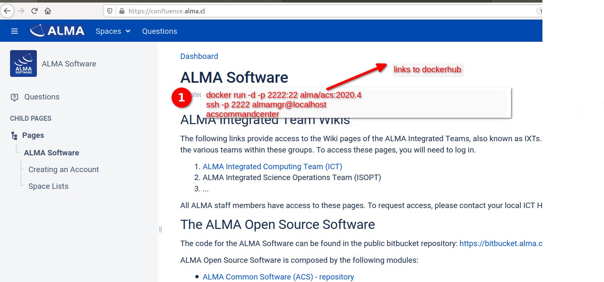
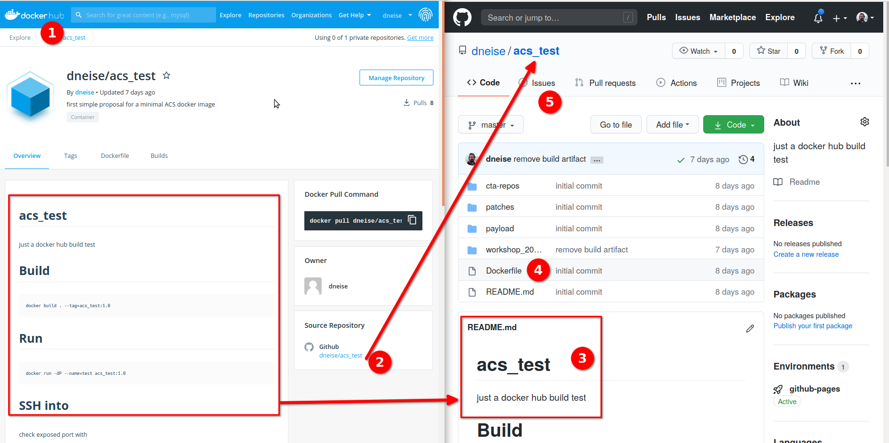

% Official Docker Image
% Dominik Neise
% 29.07.2020

---

# Official Docker Image  - or - Docker Image for Newcomers

Making the journey to knowledge a walk in the park


---

# Disclaimer

I am not a docker evangelist, in fact I only used docker in a few projects so far.

I have not much experience with virtualization in general.

So this is just me showing you a preliminary proposal, and then brainstorming?

---

# What's the problem?

ACS is hard to install. (I never managed to install it from the sources yet)

We want a strong and growing community. So we need to reduce friction loss for newcomers.

## How do people learn?

---


---

# Allow the to pull the thread!


 1. Simple Start: download & use!

 2. Allows to explore ACS examples

 3. Allows to develop and test a first component

 4. No need to unlearn: Is extentable, once developer becomes more experienced

 5. Enables to dig deeper.

---

# The Proposal

Let's provide newcomers with a ready-made *minimal* docker image, they can just
use as a start.

Provide information about its use in a *prominent place* on the ACS website.



At the *same place* provide information on how to report any issues.

---




---

# Dockerfile

<https://github.com/dneise/acs_test/blob/master/Dockerfile>

---


## Current state

This is based on:

 - an ACS Dockerfile taken from LST, where it is used for the Telescope Control Unit.
 - Patrick Sizun personal build notes
 - [DESY `acs-rpm-docker`](https://stash.desy.de/projects/ZNCTAT/repos/acs-rpm-docker)

### Docker hub page

<https://hub.docker.com/r/dneise/acs_test>

### git repo

<https://github.com/dneise/acs_test>

### Known Issues

<https://github.com/dneise/acs_test/issues>

---

# Journey

Download the image, it is pretty big and takes some time

    docker pull alma/acs:2020.4

run a fresh instance of the image named `acs`.

    docker run -dP --name=acs alma/acs:2020.4

This starts a pseudo VM on your machine, in order to play with this machine you'll
need to log into that machine, via SSH. The port you'll need to connect to is random,
so we need to ask the machine which port it uses:

    docker port acs
    # e.g. 22/tcp -> 0.0.0.0:33775

Now we can connect to the machine, we provide passwordless SSH access.
This is **insecure** but very convenient.

    ssh -p 33775 -X almamgr@localhost

---

## Trying it out

Once you are logged into the machine you can start to explore ACS examples
The first thing you might want to test, is: Can I really start a program
in the docker container:

    7f1e7e9be6fa almamgr:~ 1 > acscommandcenter

You should see the command center window opening.
If not, please send open an issue: **explain how to open issues here**

---

## Ending your day

After a day full of new experiences with the ACS docker VM, you can just disconnect from
the SSH session and stop the machine (put it to sleep), like this:

    docker stop acs

## Restarting

And tomorrow after a good nights sleep and full of new ideas, just do:

    docker start acs
    docker port acs # note down the port
    ssh -p <possibly different port than yesterday> -X almamgr@localhost

---


---

# Almost done! - Proposed Workflow

 - public repo,  ()
 - maintained by community
 - less load for ACS core devs
 - allows newcomers to examine Dockerfile & comment on it (issues)


# Brainstorming Time!


---

# Backup slides

SSH-ing into the container with checking the port is inconvenient.
Therefore I've put this into my `.bashrc`:

```bash
sshdocker(){
    if [ -z "$1" ]
    then
        echo "Usage: sshdocker <container_name>"
        return -1
    fi

    port=$(docker port $1 22 | cut -d: -f2)
    shift 1
    ssh -X -p $port $@ almamgr@localhost
}
```

And connect to a container like:

    sshdocker <container name>

Problem: No tab-completion for container name in this case.
