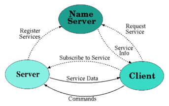

% Hardware & Software Architecture of FACT
% Dominik Neise
% 29.11.2020


# FACT

 - Chereckov Telescope
 - 1440 SiPM based readout channels (36ch / readout board)
 - Sampled with 2 GS/sec (512ns on board buffer)
 - 300 samples (12bits = 2 byte) per trigger

 - max. sustainable trigger rate $\approx 200$ Hz
 - $\Rightarrow$  $\approx 160$ MB/sec
 - data transport via TCP/IP
 - DAQ board acts as simple TCP server: waits for client to connect on port 5000
 - Trigger threshold and DAQ per channel are independ

# Trigger
 - self triggered (typical trigger rate 60Hz, i.e. ontime $\approx 10^{-5})
 - 9 neighboring channels form a "trigger patch". (160 patches)
 - channel signal is summed (analog, i.e. in real time)
 - each trigger patch sum signal compared to its own threshold -> 160 digital signals
 - camera trigger is simple hard wired OR out of 160.

# Readout

- DAQ board has 512ns (analog) buffer
- Trigger decicision takes few 10ns of ns:
    - Trigger stops sampling
    - analog data is digitzed
    - copied into onboard mem
    - subsequently send to DAQ board client via TCP/IP

# DAQ board hardware

 - TCP/IP stack implemented WIZNET W5100 chip
 - control and on-board-mem in FPGA (Xilinx Spartan)
 - Each of the 40 boards has a fixed geographical IP: `10.0.crate_id.board_id`
 - groups of 10 DAQ boards share one subnet and are routed by the same router.

# Hardware Summary

 - TCP/IP down: 1.2 MB/sec
 - DAQ board is server (only 1 client accepted)

# Bumper

 ...

# DAQ software / Eventbuilder (EVB)

 - EVB connects to 40 boards
 - retrieves individual board event data (21 kB)
 - merges them to camera event (840 kB)
 - dumps events to disk into custom compressed binary data format. (`fits.fz`)
 - a typical file contains data of 5 minutes, i.e. 20k events. ("run")

# DAQ products

 - "data" file per run: custrom compressed binary file containing timestamped camera events, with run number and run type
 - many "aux" files: std FITS files (binary tables)
 - one file per service, not per server. So there are files like:
    - `20201129_FTM_CTRL_TRIGGER_RATES.fits`
    - `20201129_FTM_CTRL_TRIGGER_THRESHOLDS.fits`
    - `20201129_FTM_CTRL_STATE.fits`
 - one row per timestamp (new row only when content changes, in order to save space)

### Caveat
Services need not to have identical timestamps, so correlation plots can be awkward.


# IPC in FACT

 - all FACT low level software comunicates via [DIM](http://dim.web.cern.ch/)
 - EVB is controlled via DIM
 - EVB emits "slow" status data via DIM as well.
 - all the other hardware control programs are also controlled via DIM
 - almost all FACT programs run on the same node.

# DIM

 - <http://dim.web.cern.ch/dim_intro.html>

{ width=60% }


# RPC in FACT

 - all FACT low level programs are implemented as a state machine
 - all have these special services:
    - STATE
    - AVAILABLE_SERVICES
    - AVAILABLE_COMMANDS
    - MESSAGES (doubles as a home brew distributed log system)
 - one special DIM client "data logger", subscibes to all existing clients services and dumps the to disk.
    - special MESSAGE service is merged by timestamp and dumped into a `yyyymmdd.log` text file

# Commands

 - Commands are defined in the implementation of each program.
 - There is not interface definition language (IDL) in use in FACT.

```Cpp
    T::AddEvent("SET_DAC_VALUE", "I:2", FAD::State::kConnecting, FAD::State::kConnected, FAD::State::kRunInProgress)
        (bind(&StateMachineFAD::SetDac, this, placeholders::_1))
        ("Set DAC numbers in range to value"
        "|addr[short]:Address of register (-1 for all)"
        "|val[short]:Value to be set");

    T::AddEvent("CONFIGURE", "X:2;C", FAD::State::kConnected, FAD::State::kConfigured, FAD::State::kRunInProgress)
        (bind(&StateMachineFAD::StartConfigure, this, placeholders::_1))
        ("Configure a new run. If the internla trigger is enabled this might even start a new run."
         "|time_max[s]:Maximum time before the run is closed in seconds (0: unlimited)"
         "|num_max[int]:Maximum number of events before the run is closed in seconds (0: unlimited)"
         "|run_type[string]:Run type which describes the runs");

    T::AddEvent("RESET_CONFIGURE", FAD::State::kConfiguring1, FAD::State::kConfiguring2, FAD::State::kConfigured)
        (bind(&StateMachineFAD::ResetConfig, this))
        ("If configuration failed and the fadctrl is waiting for something, use this to reset the state.");
```

# Prompt

 - Each FACT program, can be started with our without an interactive cmd shell
 - Commands can be issued
 - Current state can be seen
 - No Services can be seen, unless a special command is implemented which prints them to stdout.


# GUIs

We had QT4 based GUIs. One big tabbed GUI.
One Tab per program. Each command was connected to some button or text field.
Each service was displayed in some sensible way.

This was great in the lab. When integrating the channels .. and shining light
into them, we could quickly use the GUI to figure out the if the pixel mapping was messed up.
Or we could have, if the GUIs had existed at that point :D.

But this also made us rigid. We could only see things, which were forseen during GUI design.
Plot something vs. time? Impossible.
Plot something vs. DAC setting of neighboring pixel to detect strange cross talk? Impossible.

However the bug GUI and the prompts of the individual programs allowed us to start the telescope
and see "First Light".

# Generic Command Client - aka `dimctrl`

Since all Dim servers, broadcast their commands, state and services a generic
client can be implemented:

{ width=80% }

 - unfortunately, no stdout is redirected from the servers to this shell.

# Scripting

## Storytime :-)

When `dimctrl` cam into existance, we quicky wanted scripting. So our lead dev
brewed a quick an dirty script parser. Just a text file with legal DIM commands,
plus very few control statements:

```
FADCTRL/RESET_CONFIGURE
FTMCTRL/START_RUN data 1000 300  # take 1000 events in 300seconds .. stop whatever is reached first.
.w FADCTRL DONE 310              # wait for FADCTRL to be in state DONE, timeout after 310 seconds
```

This scripting engine had:
 - no variables
 - no if, apart from waiting for a state
 - no loops

This came into life, after we started runs manually by clicking a "Start Run" button
every 5 minutes for a few nights.
So even if loops were missing, we could just copy and paste commands and now
start one scripts for an hour .. do some repositioning .. and start the next script again.

# Databases

### Configuration Database

Each program needs a bit of configuration during startup. This was handled by
INI style so called `.rc`-files in the beginning. Easy to change and play around.

After some time, all (well .. most of them) settings were stored in a Database.
The programs read their configuration during startup from that DB.

The DBs web frontend takes care of storing a history of changes.
In FACT having a small git-repo with `.rc`-files would have been easier and less error prone.

Needing the MySQL DB to run, in times before docker, was a liability.

 - Run Database

After DAQ is a single 5min run is done and the file is on disk a simple bash script
runs periodically to list all the files on disk and put newly created files into a DB.
This DB is a starting point of all kinds of downstream archiving and analysis book keeping.
Where is a file right now? Is it already calibrated or even analyzed?

# Feedbacksystems

FACT needs a feedback system to keep the SiPM overvoltage stable.
The overvoltage is a known function of temperature and current. The camera
measures both (different services of different servers).

One program subscribes to the relevants services, and adjusts the applied
SiPM voltage according to the most recent temperature and current measurements.

This took FACT about 2 years. It would not be wise to need very long for this.

# Real Scripting

So as I said before, the home brewed script interface had many problems.

So we wanted a real scripting language. Some proposed Python (via PyDIM) some proposed JS.
JS won the scripting language wars in FACT.

What came then, was one monolithic script on top of the existing many DIM programs.
The input to this script was a nighly schedule, which it would try to execute, while
periodically interleaving either calibration runs, or other consistency checks.


# Web Display

Since working with real GUIs via remote X connections, like `ssh -X`, `VNC` or whatever is awkward and slow.
We wanted to move to the web.
FACTs status (i.e. the lates value of some selected interesting DIM services) is publicly visible on the web:
  - simple logger, subscribes to relevant DIM services and dumps current state into homebrew text files
  - webserver machine mounts that folder with text files
  - JS website periodically reads those text files and updates its display.

# Web control

The same website allows, after login, to issue a selected subset of commands.
These commands are issued via a DIM server running on the web server host into the JS DIM script interpreter.

# Summary

 - low level programs can and are still controlled via their CLI interface
 - QT4 guis were completely abandoned, imho waste of time to program them.
 - Config DB in case of a single telescope, imho overkill.
 - Instead of DIM, nowadays maybe GPB via ZMQ & then gRPC on top?
 - Think about synchronizing slow data to simplify correlation plots?
